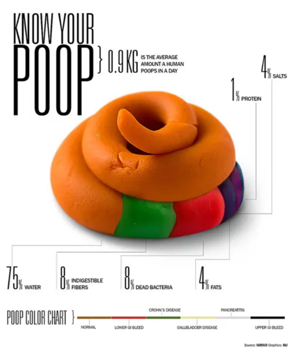
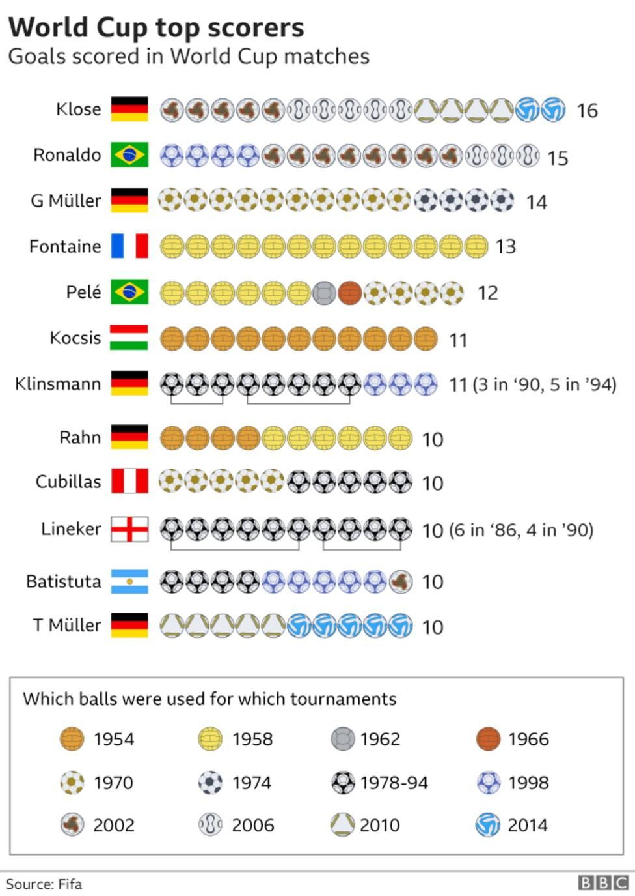

# Given Vis. Critique

Let **item** be the **POOP**

### Data Represented:
The data here is represented by graphics similar to "Pie Chart, whereas we could see that each portion of the item is divided by proportions of size that they occupy (except for the majority portion which is water, that has a weird shape). Moreover, these proportions are labelled by color differentiating distinct forms/status (normal/bleed or etc) of the item. So we have two features here: 

- `Color` , nominal, this stands for status of the item from what person
- `Nutrient/material`, quantitave, this stands for constitution of the proportion of item (water/dead bacteria/fats or more)

### Data encoding:

Let **item** be the **POOP**

The mark use here is like combination of mark_arc and mark_area, essentially pie chart and fille area plot. Then it is hard to tell which channels it encodes, very unlikely to have an axis of `x` and `y` (at least I can imagine it out). Therefore, known channels are like `color`, where each proportion not only represented the consitution of that part but also displaying different health status of the item; `text` is also present to label what proportion is. Lastly, a less obvious could be `size`, where I argue that larger the numeric proportion it is, also the larger is the that part of the item visually.

### Critique the visualization by expanding on the characteristics of the channels and how they are suited for the given attribute

### Question the visualization answer:

### Visualization is effective:

### Visualization is ineffective:

# Given Vis. Redesign

> Import image here (drawing)

# Selected Vis. Image and Reference

Retrieved from :[https://www.bbc.com/sport/football/44388118](https://www.bbc.com/sport/football/44388118)

# Selected Vis. Critique

Let **item** be the **POOP**

### Data Represented:

### Data encoding:

### Critique the visualization by expanding on the characteristics of the channels and how they are suited for the given attribute

### Question the visualization answer:

### Visualization is effective:

### Visualization is ineffective:

# Selected Vis. Redesign

> Import selected redign here (drawing)